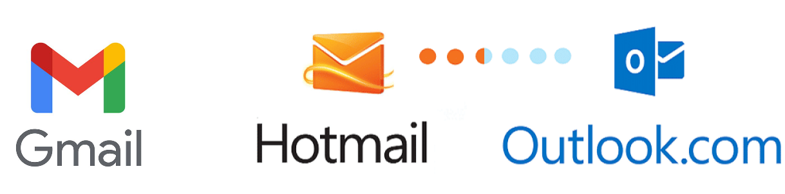
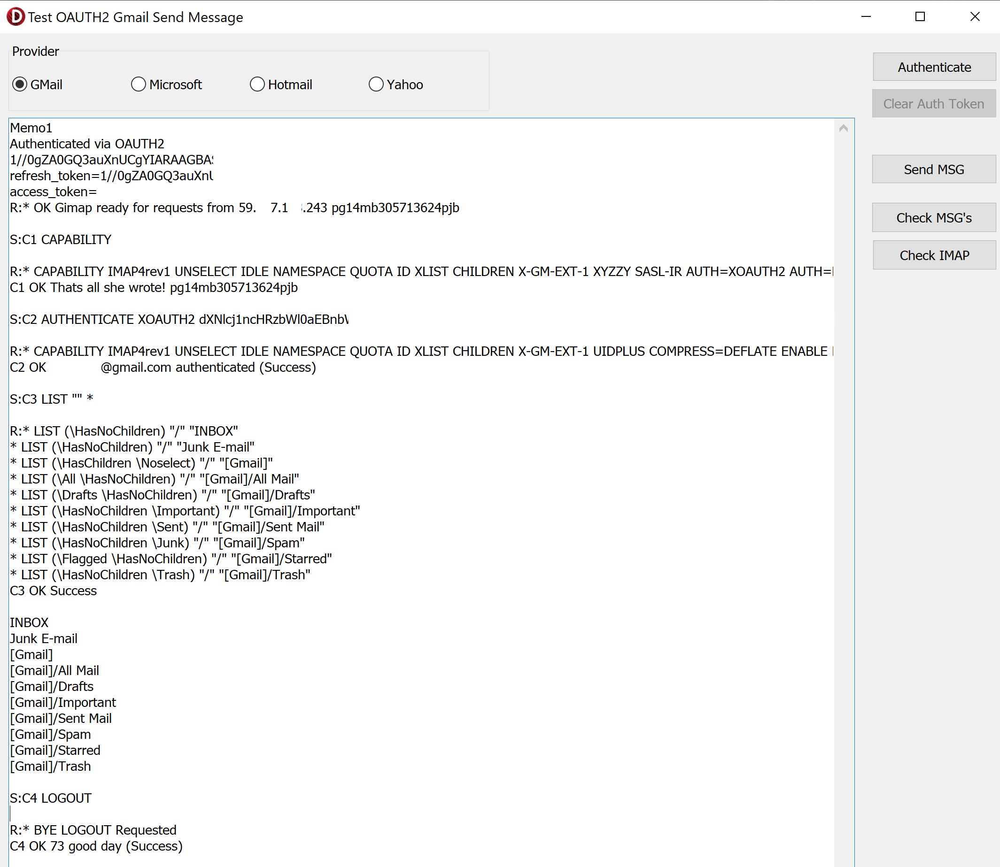
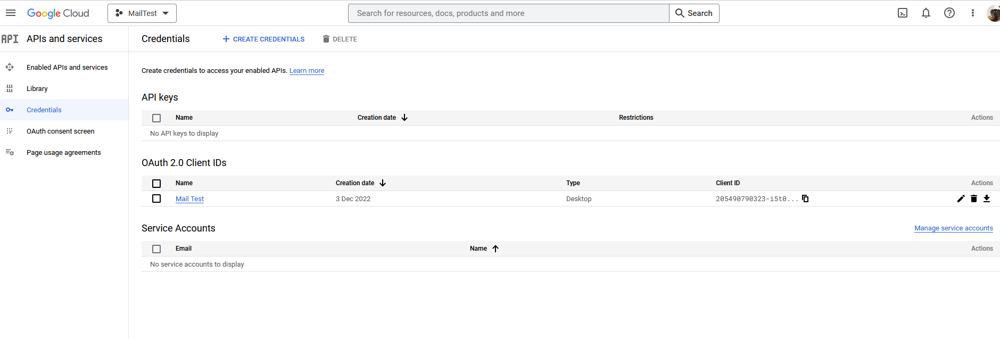

# GmailAuthSMTP

This project is a very basic demo showing how to authenticate with OAUTH2 and send an email message for [gmail](https://www.gmail.com), [microsoft/office365](https://outlook.office.com/mail/) as well as [hotmail.com/outlook.com/live.com](https://www.outlook.com) email addresses.  Initially it was only for Gmail (hence the name), but has since been extended to support other other providers.

OAuth2 is an open standard for authorization that is used to grant access to resources protected by a server. It allows an application or service to authenticate with a resource server and access protected resources on behalf of a user, without requiring the user to provide their credentials directly to the application.

When a user wants to access their email using an email client or another application, the application can use OAuth2 to authenticate with the email service and request access to the user's email. The user is then prompted to log in to their email account and grant access to the application. Once access is granted, the application can use the OAuth2 access token to authenticate with the email service and access the user's email.

Using OAuth2 for authentication has several benefits. It allows users to grant access to their email without sharing their login credentials with the application, which helps to protect their privacy and security. It also makes it easier for users to access their email from multiple devices and applications, as they only need to grant access once and can then use the OAuth2 access token to authenticate with the email service from any device.

## Google Setup

You will need to create a file called Globals.pas which contains the following constants

  * google_clientid
  * google_clientsecret
To get these, go to https://console.cloud.google.com/apis/credentials

  * google_clientaccount

## Microsoft Setup

  * microsoft_clientid
  * microsoft_clientaccount
To get these, go to https://portal.azure.com/#blade/Microsoft_AAD_RegisteredApps/ApplicationsListBlade
Microsoft will also need various app permissions as shown below

  * clientsendtoaddress
  * clientname

## Dependencies
This project requires OpenSSL.  You can find the required files at https://github.com/IndySockets/OpenSSL-Binaries

Thanks

Geoffrey Smith
